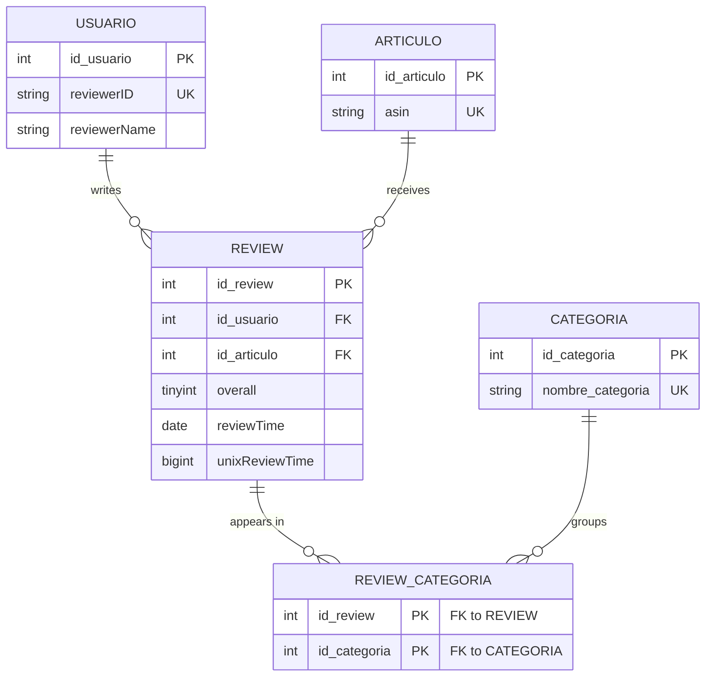
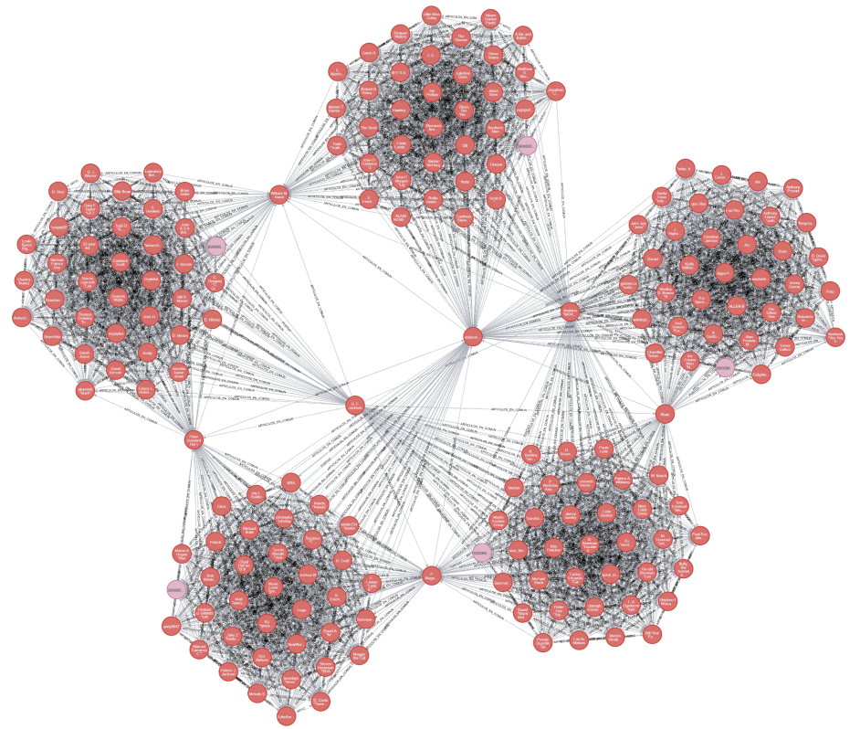
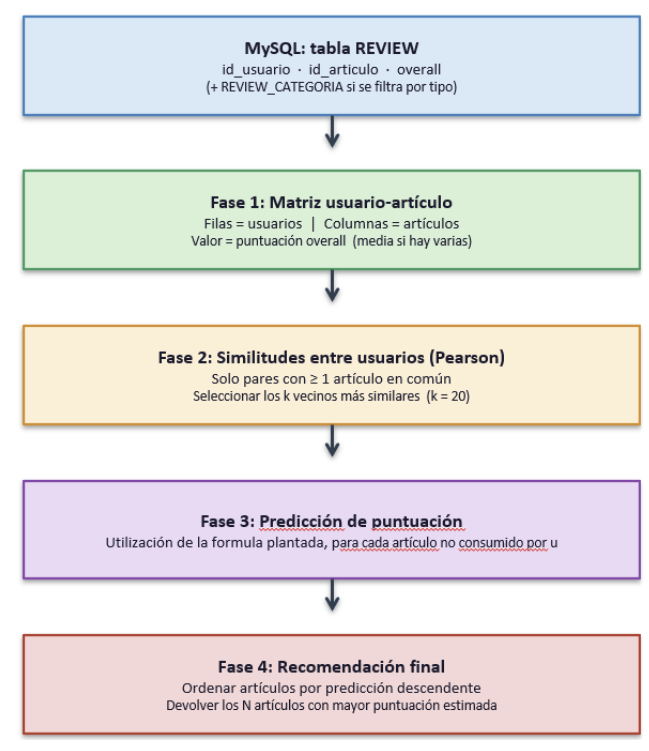

# Amazon Reviews Data Platform

Hybrid database project for storing, analysing, visualising and recommending products from Amazon review data. The system combines **MySQL**, **MongoDB** and **Neo4j**, with all database creation, loading, querying and graph generation implemented in Python.

This project was developed by **Rodrigo Alejandro Sicilia Maroto** and **Claudia Moya Rodríguez** as the final project for the Databases course in the second year of the Mathematical Engineering and Artificial Intelligence degree at ICAI – Universidad Pontificia Comillas (2025/2026).

## Project overview

The project works with four Amazon 5-core review datasets:

| Dataset | Reviews |
| --- | ---: |
| Toys and Games | 167,597 |
| Video Games | 231,780 |
| Digital Music | 64,706 |
| Musical Instruments | 10,261 |
| **Total** | **474,344** |

Of those records, 387 reviews appear in more than one source file. They are stored once and their provenance is preserved, as explained below. A fifth dataset, Office Products, can be inserted incrementally with `inserta_dataset.py`, which takes the loaded corpus above 500,000 reviews.

The original data is split between two database systems according to its structure:

- **MySQL** stores users, products, categories and the structured part of each review.
- **MongoDB** stores the textual and flexible fields of each review, including the review text, summary and helpfulness information.
- **Neo4j** is used to build and explore several graph representations involving users, products, categories and user similarity.

## Database design

The relational model is built around five tables. Every review is linked to the user who wrote it and the product it refers to, and its source category is recorded separately in `REVIEW_CATEGORIA`.



`REVIEW` carries a `UNIQUE(id_usuario, id_articulo, unixReviewTime)` constraint, which is what identifies a logical review and prevents exact duplicates from being inserted twice.

### Why the category belongs to the review, not to the product

The same ASIN can appear in several of the source files, so a product is not tied to a single category. An earlier version of the model used an intermediate `ARTICULO_CATEGORIA` table, but that turned out to be wrong for the queries the project needs: if the category is derived from the product, a review written in one dataset shows up when querying a different one, simply because the product also exists there.

Checking the raw files confirmed the problem. `verificar_datasets.py` reads the four JSON files line by line and groups reviews by `reviewerID`, `asin` and `unixReviewTime`. It found **387 reviews present in more than one file**, all of them exact repetitions, with no conflicting cases. That result justified the final design: `REVIEW` stores each logical review once, and `REVIEW_CATEGORIA` records every source category in which it appeared. `ARTICULO_CATEGORIA` was removed from the model, and every category-level query in the project goes through `REVIEW_CATEGORIA`.

The same check showed that `reviewerName` is not reliable as an identifier: the same `reviewerID` sometimes appears with a name and sometimes without, and occasionally with different names. `reviewerID` is therefore the unique key of `USUARIO`, and `reviewerName` is kept as a descriptive attribute only.

### Document side and indices

The MongoDB collection `reviews_texto` stores `helpful`, `summary` and `reviewText`, plus the `id_review` that links each document to its MySQL row. That field carries a UNIQUE index, which both speeds up the join between the two systems and protects the collection against duplicates.

Beyond the indices implied by primary keys and UNIQUE constraints, four indices were added by hand, each for a query the project actually runs: `REVIEW_CATEGORIA(id_categoria, id_review)` for the category filters, `REVIEW(reviewTime)` and `REVIEW(unixReviewTime)` for the temporal aggregations, and `USUARIO(reviewerName)` for the alphabetical user selection in the Neo4j section. No index was created on `REVIEW(overall)`, because its cardinality is too low to justify the cost.

## Main features

### Data validation and loading

- Processes the JSON files line by line instead of loading them fully into memory.
- Creates the MySQL database, tables, keys and constraints from Python.
- Creates and populates the MongoDB collection from Python.
- Detects duplicate reviews and preserves their source categories.
- Validates assumptions about duplicated reviews, multicategory products and reviewer names.
- Supports incremental insertion of an additional review dataset.

### Load performance

The first working version of `load_data.py` issued between six and eight queries per review, which meant millions of round-trips to MySQL for a corpus of this size. Three changes brought the load time down without altering the data model or the final result:

- **In-memory caches** for `USUARIO` and `ARTICULO`, so that a `reviewerID` or an `asin` is looked up in MySQL only the first time it appears.
- **`INSERT IGNORE` instead of SELECT-then-INSERT** at the two points where duplicates can occur. For `REVIEW_CATEGORIA` the composite key makes this a straight replacement of two queries by one. For `REVIEW` the identifier still has to be recovered, so the insert is attempted first and a fallback `SELECT` runs only when MySQL rejects the row, which in practice happens only for the 387 cross-dataset duplicates.
- **Batched MongoDB writes** of 10,000 documents with `insert_many` instead of one `insert_one` per review. If part of a batch fails, the corresponding MySQL rows are removed so that both databases stay in sync.

### Data visualisation

The project provides seven visual analyses:

1. Number of reviews by year.
2. Product popularity distribution.
3. Rating histogram.
4. Cumulative review evolution over time.
5. Number of reviews per user.
6. Word cloud by product category.
7. Average rating by category.

The visualisations are available through both a terminal menu in `menu_visualizacion.py` and an interactive Tkinter dashboard in `dashboard.py`. The dashboard imports the query functions from the terminal menu rather than duplicating them, so both interfaces share the same data-access logic.


The word cloud combines both databases: the review identifiers for a category are obtained from MySQL through `REVIEW_CATEGORIA`, and the corresponding summaries are then retrieved from MongoDB in batches of 50,000, accumulating word frequencies with a `Counter` instead of building a single large string.

Four of these visualisations were also rebuilt in Power BI from CSV exports of the same SQL queries, as an alternative to the Python versions. The resulting panel is included in the project report.

### Neo4j graph analysis

`neo4JProyecto.py` implements four graph-based analyses:

- Pearson similarity between the most active users.
- User-product relationships for randomly selected products.
- Relationships between users and the different product categories they reviewed.
- Popular products, their reviewers and the number of products reviewed in common by each pair of users.



MySQL is used as the computation layer and Neo4j purely as the visualisation layer: selections, filters and aggregations run in SQL, and only the resulting nodes and relationships are loaded into Neo4j with `UNWIND` and `MERGE`. Uniqueness constraints on the node identifiers provide the indices that make `MERGE` efficient.

### Recommendation systems

Two recommendation approaches are included:

- `recomendacion.py`: recommends the ten most popular products in a category that a user has not previously reviewed.
- `modelo_ml.py`: implements user-based collaborative filtering with Pearson correlation.



The collaborative-filtering model was evaluated by splitting each user's ratings into 80% training and 20% test, with a fixed seed, and predicting the test ratings from the *k* = 20 most similar neighbours. The result was a **mean absolute error of 0.8388** on a 1-to-5 scale, over 27,489 predictions. A further 84,541 test ratings could not be predicted at all because the user had no neighbour who had rated that product, which is the expected consequence of a very sparse user-item matrix.

## Repository structure

```text
.
├── configuracion.py           # Database credentials, database names and dataset paths
├── load_data.py               # Creates and loads the MySQL and MongoDB infrastructure
├── verificar_datasets.py      # Validates assumptions about the source datasets
├── menu_visualizacion.py      # Terminal-based visualisation menu
├── dashboard.py               # Tkinter graphical dashboard
├── neo4JProyecto.py           # Neo4j graph generation and analysis
├── recomendacion.py           # Popularity-based recommender
├── modelo_ml.py               # Collaborative-filtering recommender
├── inserta_dataset.py         # Inserts an additional product category
├── requirements.txt           # Third-party Python dependencies
├── .gitignore
├── LICENSE
├── assets/                    # Figures used in this README
├── Informe_Proyecto_BD.pdf    # Full technical report
└── Poster_Proyecto_BD.pdf     # Project poster
```

## Requirements

The project requires:

- Python 3.9 or newer
- MySQL Server
- MongoDB Community Server
- Neo4j Desktop or Neo4j Server

Install the Python dependencies with:

```bash
python -m pip install -r requirements.txt
```

`requirements.txt` pins the exact versions of the five direct dependencies used during development: PyMySQL, PyMongo, the Neo4j Python driver, Matplotlib and WordCloud. Transitive dependencies are left to pip.

Tkinter is part of the standard Python distribution on Windows. On some Linux distributions it may need to be installed separately.

## Dataset setup

The raw datasets are **not included in this repository**. Download the corresponding Amazon 5-core review files and place them in the repository root, alongside the Python scripts:

```text
Toys_and_Games_5.json
Video_Games_5.json
Digital_Music_5.json
Musical_Instruments_5.json
```

The optional incremental-loading script also expects:

```text
Office_Products_5.json
```

The `.gitignore` excludes `*_5.json`, so these files will not be committed by accident.

The data source used for the project is the Amazon Product Data collection maintained by Julian McAuley at UCSD:

<https://jmcauley.ucsd.edu/data/amazon/index_2014.html>

Do not rename the files unless the corresponding paths are also updated in `configuracion.py` or `inserta_dataset.py`.

## Configuration

All connection parameters and dataset paths are centralised in `configuracion.py`, so the project can be run in a different environment by editing that single file. It is distributed with placeholder credentials, which must be replaced with local ones before running anything:

```python
MYSQL_HOST = "localhost"
MYSQL_USER = "your_SQL_user"
MYSQL_PASSWORD = "your_SQL_password"

MONGO_HOST = "localhost"
MONGO_PORT = 27017

NEO4J_HOST = "localhost"
NEO4J_PORT = 7687
NEO4J_USER = "neo4j"
NEO4J_PASSWORD = "your_neo4j_password"
```

The database servers must be running before executing the scripts. Run all commands from the repository root because the project uses relative paths for the JSON files.

> **Security note:** these are placeholders, not working credentials. Do not commit real database passwords to a public repository.

## Execution

### 1. Optional dataset validation

The validation script examines the source files line by line and checks the assumptions used in the database design:

```bash
python verificar_datasets.py
```

### 2. Create and load the databases

```bash
python load_data.py
```

> **Warning:** this script recreates the project tables in MySQL and clears the MongoDB review collection before loading the data again. Do not point it at databases containing information that must be preserved.

### 3. Run the visualisation menu

```bash
python menu_visualizacion.py
```

### 4. Run the graphical dashboard

```bash
python dashboard.py
```

### 5. Run the Neo4j analysis

```bash
python neo4JProyecto.py
```

Some Neo4j menu options clear the existing graph before loading a new representation. Use a dedicated project database if the existing Neo4j data must be preserved.

### 6. Run the popularity-based recommender

```bash
python recomendacion.py
```

### 7. Run the collaborative-filtering model

```bash
python modelo_ml.py
```

### 8. Insert the additional dataset

After placing `Office_Products_5.json` in the repository root:

```bash
python inserta_dataset.py
```

## Authors and contributions

### Rodrigo Alejandro Sicilia Maroto

- Designed and implemented the MySQL data model and backend.
- Analysed the source JSON files to validate the design assumptions.
- Developed `load_data.py`, `configuracion.py`, `neo4JProyecto.py` and `inserta_dataset.py`.
- Implemented the popularity-based recommendation mechanism.

### Claudia Moya Rodríguez

- Developed the seven visualisation functions and the complete terminal menu in `menu_visualizacion.py`.
- Produced the Power BI visualisations.
- Led the writing and documentation of the technical report.
- Participated in the validation and documentation of the database design.

### Joint work

- Key design decisions, including the use of `REVIEW_CATEGORIA`.
- Code review, correction and integration.
- Optional components, conclusions and final delivery preparation.

## Documentation

The repository includes two additional documents:

- [Full project report](Informe_Proyecto_BD.pdf)
- [Project poster](Poster_Proyecto_BD.pdf)

The report contains the complete design justification, database diagrams, implementation decisions, screenshots, results and discussion.

## Limitations

- The project depends on three external database servers and is not a single-command deployment.
- Connection settings and dataset paths must be configured manually.
- The raw datasets are not distributed with the repository.
- The collaborative-filtering model is affected by the sparsity of the user-product matrix: in the evaluation described above, 84,541 of the test ratings had no usable neighbour and could not be predicted.
- The value of *k* in the collaborative-filtering model was fixed experimentally rather than tuned by cross-validation.
- The implementation was developed as an academic project and is not intended as a production service.

## License

The source code is released under the [MIT License](LICENSE), jointly by both authors. The source datasets belong to their respective authors and distributors and are not covered by this licence.

## Academic use

This repository is provided as an academic portfolio project. The code and accompanying documents were produced jointly by Rodrigo Alejandro Sicilia Maroto and Claudia Moya Rodríguez.
